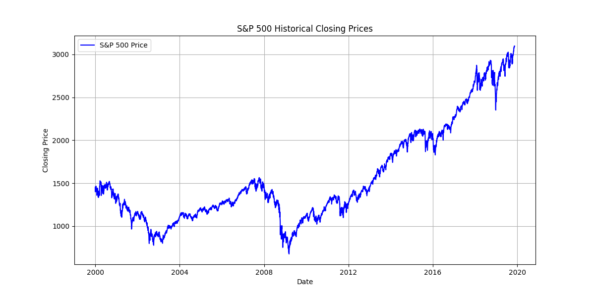
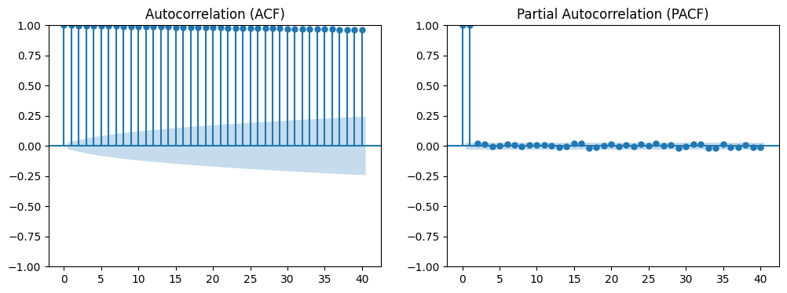
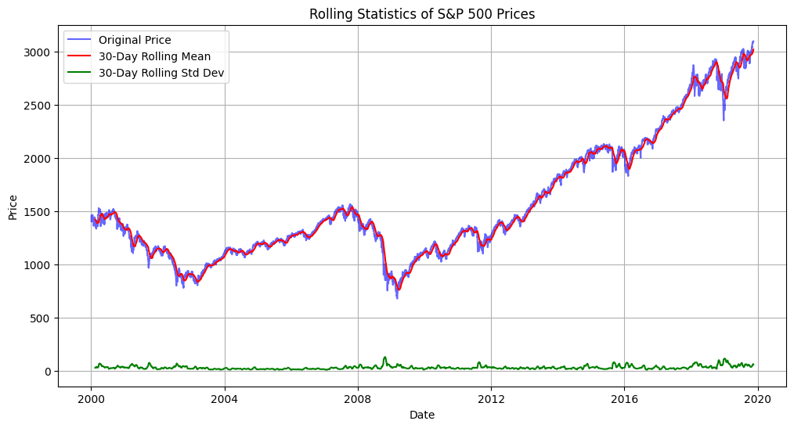
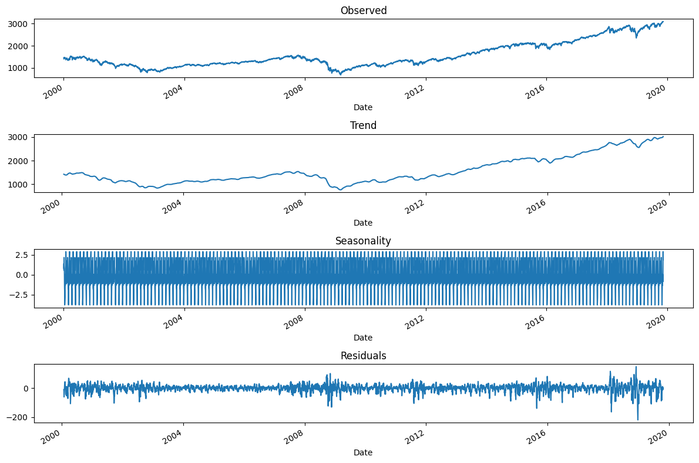

---

# Stock Price Forecasting


This repository contains code and resources for forecasting stock prices using machine learning and time series analysis techniques. The goal of this project is to predict future stock prices based on historical data, leveraging models such as LSTM, ARIMA, and others. The focus is on analyzing S&P 500 historical data, checking for stationarity, and visualizing key statistical properties before applying forecasting models.

## Features

### Data Loading and Cleaning
- Reads historical stock price data from a CSV file.
- Converts numerical values and removes unnecessary characters.
- Sorts data in ascending order for proper time series analysis.

### Exploratory Time Series Analysis
- **Augmented Dickey-Fuller (ADF) Test**: Checks for stationarity.
- **Autocorrelation and Partial Autocorrelation (ACF & PACF)**: Identifies lag dependencies.
- **Rolling Statistics**: Computes and visualizes rolling mean and standard deviation.
- **Seasonal Decomposition**: Breaks the time series into trend, seasonality, and residual components.

## Installation

Clone the repository and install dependencies:

```bash
git clone https://github.com/wajoel/forecasting-stocks.git
cd forecasting-stocks
pip install -r requirements.txt
```

## Usage

Run the main script to analyze S&P 500 historical data:

```bash
python main.py
```

## Data Requirements
The dataset should be in CSV format, containing columns such as:
- **Date**: Historical date of stock prices.
- **Price, Open, High, Low**: Numerical values representing stock performance.
- **Change %**: Daily percentage change.

## Example Outputs

### Data Visualization
Below is an example visualization of stock price trends:



### ADF Test Results

- Provides a test statistic and p-value to determine stationarity.

### ACF & PACF Plots

- Visualizes lag correlations to identify autoregressive patterns.

### Rolling Statistics

- Displays moving averages and standard deviations over a 30-day window.

### Time Series Decomposition
- Separates the time series into observed, trend, seasonality, and residual components.

## Dependencies
- Python 3.x
- Pandas
- NumPy
- Matplotlib
- Statsmodels

## Author
[Wajoel](https://github.com/wajoel)

## License
This project is licensed under the MIT License.

---
